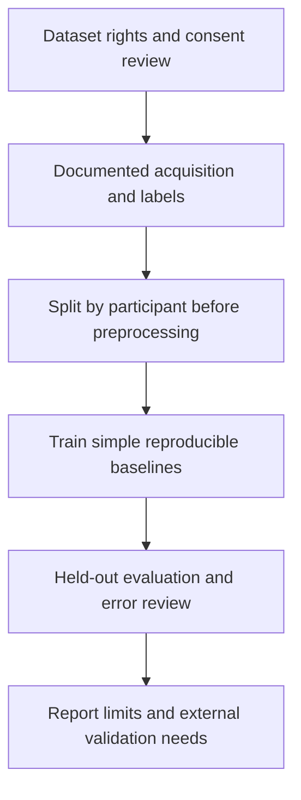

# Thermography and Deep Learning — Research Brief

**An early research direction in thermal imaging and computer vision.**

Brian's portfolio records participation in a team exploring thermal imaging with CNN/segmentation methods for breast-screening research. The available materials establish a research topic and literature collection, not a trained, validated or clinically deployed system.

**Status: research planning.** No source, patient images, model weights, diagnostic claims or performance figures are released. Thermography in this project is not established as a standalone screening or diagnostic tool and is not a replacement for established clinical assessment.

## Research questions

- What reproducible image-acquisition protocol and ground-truth labels are available?
- Can a baseline model generalize across participants and acquisition sessions?
- What changes under different cameras, environments and image preprocessing?
- Which failure modes and dataset biases remain after evaluation?

## Proposed workflow — not implemented

Candidate methods in the portfolio include CNNs and segmentation. No choice of Mask R-CNN or claimed novelty is finalized by this brief. Start with a data audit and a simple baseline before adding model complexity.

## Evidence required

| Item | Current status |
| --- | --- |
| Dataset, license and acquisition protocol | Not verified for publication |
| Participant identifiers and split | Not available |
| Labels and reference standard | Not available |
| Baseline code and reproducible environment | Not available |
| Held-out metrics and confidence intervals | Not available |
| Independent external validation | Not performed in this task |

## Evaluation plan

Keep all images from a participant in one split. Fit preprocessing only on training data. Report sample/participant counts, class prevalence, sensitivity, specificity, precision, recall, F1, ROC/PR curves as appropriate, calibration and confidence intervals. Include failed/low-quality acquisitions and review generalization across sites/cameras. These are planned evaluation requirements, not achieved results.

## Contribution and next step

Brian's role is recorded as research-team participation. The first publishable milestone is a rights-cleared dataset card, a participant-disjoint baseline and an honest error analysis. Dataset images, collaborator documents and unpublished project details stay private until permissions are clear.

This brief is a lower-priority portfolio item than the runnable software and embedded examples. It should not be pinned ahead of a verified odometry implementation if that becomes available. No license has been selected.
